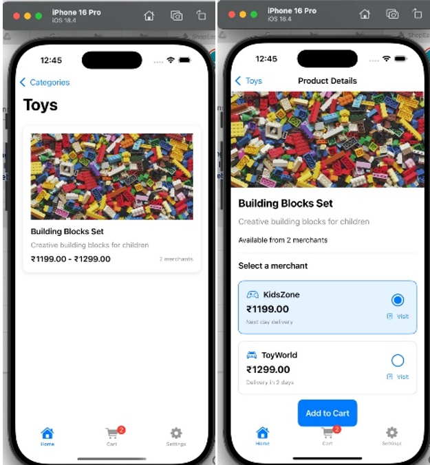

# ShopEasy

**ShopEasy** is an iOS shopping aggregator application that allows users to **search, compare, and purchase** products from various e-commerce platforms—all through one clean, unified interface. Built with **SwiftUI**, **Firebase**, and structured using the **MVVM** architecture.

---

##  App Screens & Flow

###  1. Login Screen

On launch, users are greeted with a **Signup/Login screen** featuring:
- ShopEasy logo
- Options to **Sign in with Google** (via Firebase Authentication)
-**Sign Up with email**, which collects:
  - Full name
  - Email address
  - Password

>  Google Sign-In ensures fast access.  
>  The Sign-Up form is ideal for new users preferring to create an account using email.  
>  Once authenticated, users are redirected to the **Home Page**.
---

### 2. Home / Browse Screen

- Displays a feed of **product listings** from multiple vendors.
- **Search bar** at the top.
- Each item shows **image**, **title**, and **price**.
- Tap any item for **Product Details**.
- **Cart icon** shows current item count.

>  Product data is managed using **Cloud Firestore** with real-time updates.

---

### 3. Search Functionality

- A dedicated **Search Screen** allows users to:
  - Enter keywords
  - See **live-matching results**
- Results include:
  - Thumbnail
  - Product name
  - Price

>  Powered by local product queries (and can be extended with APIs).

---

### 4. Product Detail Screen

- Displays:
  - Larger product image
  - Description
  - Price
  - Vendor info
- Options:
  - **Add to Cart**
  - **Visit Vendor Site** (web view or Safari)

> Data is dynamically loaded from Firestore.

---

### 5. Cart Screen

- Lists all added items with:
  - Name, price, quantity, subtotal
- Users can:
  - Adjust quantity
  - Remove items
- Displays **Total Price**
- **Checkout** redirects to vendor's page

>  Cart data is saved under the user’s Firestore profile for persistence.

---

### 6. Vendor Redirection

- At checkout, the app opens the **vendor’s online store**.
- Uses SafariView or similar browser integration.

>  Final transactions are handled on the vendor’s side.

---

## Admin Panel

- Restricted to users with an **admin email ID**.
- Allows uploading of **mock product data** to Firebase.
- Supports future integration with scraped or real-time inventory data.

---

## Firebase Integration

- **Firebase Authentication**  
  - Handles Google Sign-In

- **Cloud Firestore**  
  - Stores:
    - Product listings
    - User profiles
    - Cart data
  - Real-time sync for dynamic updates

- **Custom FirebaseManager**
  - All Firebase calls are abstracted here.
  - ViewModels interact only with this manager (clean MVVM design).

---

